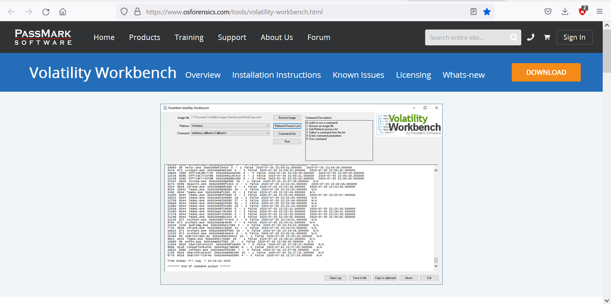
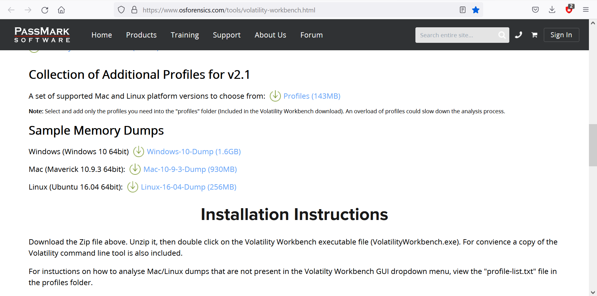
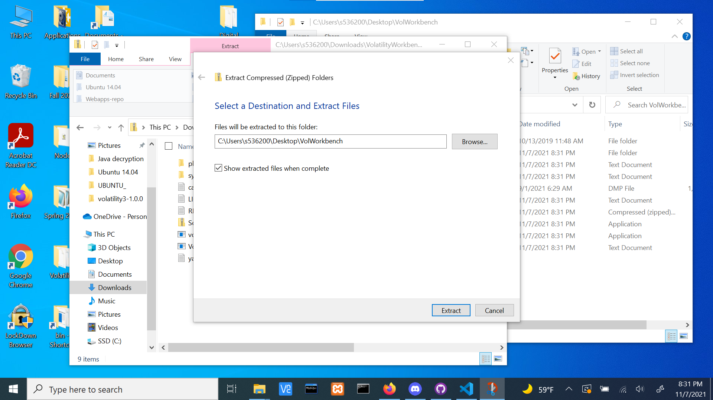
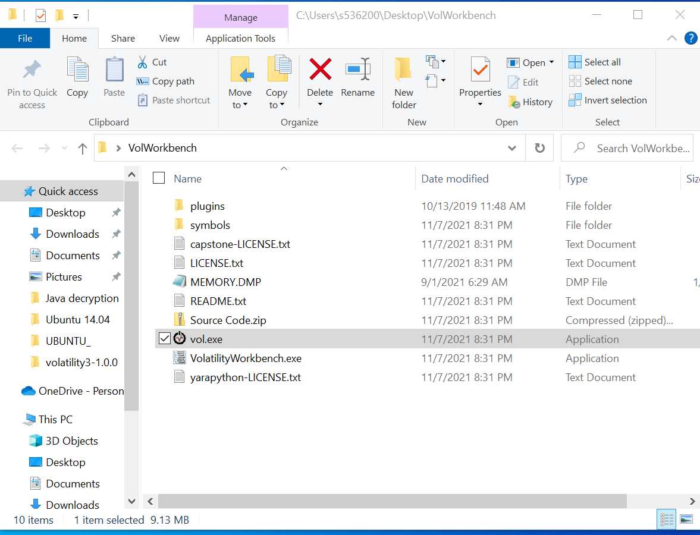

I was tasked with showing how to analyze the memory of a computer/device given the memory dump of the device.
To begin with, Volatility was always meant to be a command line tool. But, a nifty company took Volatility and made a Graphical User Interface (GUI). This allows the user to use Volatility without having to remember all of the commands, and without having to fully install python and run command line.
---
# This is how I got Volatility to work:

A well known company that should sound familiar to all Digital Forensics students is PassMark. We have used PassMark throughout the whole semester to analyze Disk Dumps of complete systems. PassMark makes a friendly to use tool called OSForensics. But after doing some research, I found that PassMark has a free tool that isn't really promoted for Volatility.
---
# Volatility Workbench

Volatility Workbench is the tool that I will be demonstrating on for this presentation. To start off, you go to PassMark's website or search Volatility Workbench PassMark. You go to the website and download the client. Sadly, the client is only for windows.

Do not forget to download the Memory Dump Sample to make sure your applicaiton is working correctly.

# Installation
Next, you will go to your downloads, and extract the .zip file for Volatility Workbench into another directory of your choosing.

After extracting all of the files, you will run the application called vol.exe.

When this is done running (it will open a command line and install volatility), then you will run VolatilityWorkbench.exe

That's it, you are all ready to use Volatility!!
