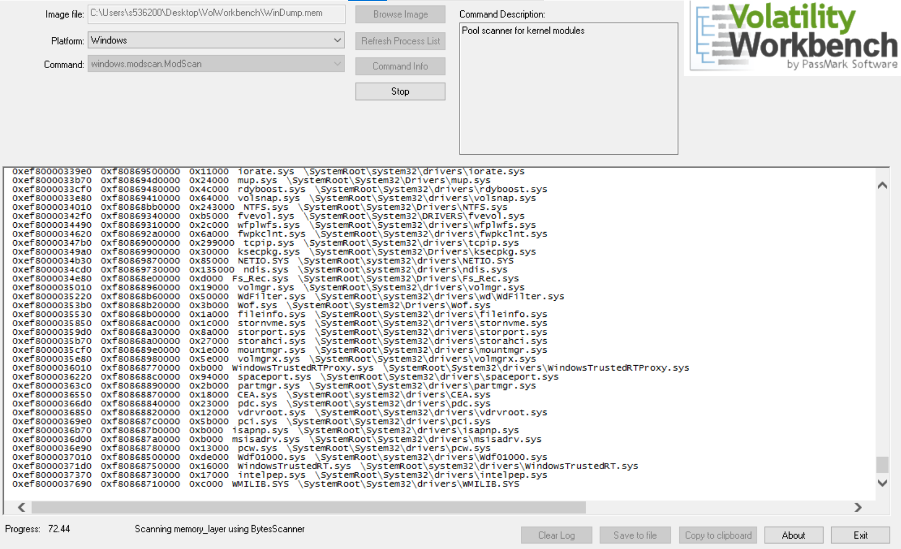

# Listed Below are Useful Commands for Memory Analysis
## cmdline
The command line lists the arguements used by different applications. This could be useful when trying to narrow down what application is executing specific malware in the command line.

## dlldump
Dll dump is really useful when trying to found which digital library is being used in multiple places. Many digital forensics responders verify which dll's should be running and which dll's are suspicious. This is a common practice and has helped solve multiple cases about malware on computers.

Be wary, this command will dump all dll's if there are not specific parameters in place. I made this mistake and all the dll's in the Memory dump were put in one of my working directories. It's nice to have all of these, but for a test purpose, they were not needed.

## Hivelist
Hivelist are unique in the registry. Every time a setting is changed on a program or on the desktop, the registry is updated. With volatility, we can carve through the registry hive using the hivelist and with a little more work, we can get keys and subkeys with different values. This helps us know what is, or was changed in the registry while certain programs were running. This also helps us understand what information a program is saving in the memory and to the device itself.

## Modscan
Modscan is useful in its own unique way. When drivers are downloaded (especially for programs), they are used to make sure the interactions between the device and program is correct. Well, malware can use the same technique. Malware can store drivers and different ways to speak with outside programs. With the modscan command, we can see what drivers are downloaded, and where the drivers are downloaded to. This can help narrow down malicious content. All of this can be found in the stored memory on a device.

### Just a note to everyone looking at this. The information stored on the memory on your device is substantial. With volatility, you can carve your way through the memory of a device and get information that is stored on the device. With great power comes great responsibility. We must remember that not only digital forensics investigators/responders use these tools. With volatility, you can get passwords off of a device using volatility (especially hivelist/hivedump). There is a more information and ways to access this information than I have time for. If you are interested, links are provided below to Volatility workbench and Volatility's command Reference which is are my main resources in this presentation.

#### Resources
1. https://github.com/volatilityfoundation/volatility/wiki/Command-Reference#modscan
2. https://www.osforensics.com/tools/volatility-workbench.html
3. https://www.dummies.com/computers/operating-systems/windows-xp-vista/understand-how-the-windows-registry-works/